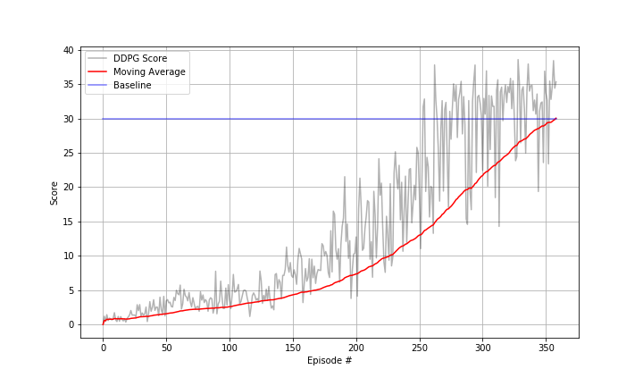

# Project Report

## Learning Algorithm

To solve this project `Deep Deterministic Policy Gradient` algorithm was used. The details of the algorithm can be found in the paper given by DeepMind: [CONTINUOUS CONTROL WITH DEEP REINFORCEMENT
LEARNING](https://arxiv.org/pdf/1509.02971.pdf)

### Hyperparameters

The hyper-parameters used for the Agent model are:

```
BUFFER_SIZE = int(1e6)  # replay buffer size
BATCH_SIZE = 128        # minibatch size
GAMMA = 0.99            # discount factor
TAU = 1e-3              # for soft update of target parameters
LR_ACTOR = 1e-3         # learning rate of the actor
LR_CRITIC = 1e-3        # learning rate of the critic
WEIGHT_DECAY = 0        # L2 weight decay

LEARN_EVERY = 20        # learning timestep interval
LEARN_NUM   = 10        # number of learning passes
GRAD_CLIPPING = 1.0     # Gradient Clipping

# Ornstein-Uhlenbeck noise parameters
OU_SIGMA  = 0.15
OU_THETA  = 0.05

EPSILON       = 1.0     # for epsilon in the noise process (act step)
EPSILON_DECAY = 1e-6
```

### Model Architecture

The model for the Actor_Network is as follows:

```
(fc1) = nn.Linear(33, 400)
(bn1) = nn.BatchNorm1d(400)
(fc2) = nn.Linear(400, 300)
(fc3) = nn.Linear(300, 4)
```
where (bn1) and (fc2) are followed by ReLU and (fc3) is followed by Tanh activation functions.

The model for the Critic_Network is as follows:

```
(fcs1) = nn.Linear(33, 400)
(bn1) = nn.BatchNorm1d(400)
(fc2) = nn.Linear(400+4, 200)
(fc3) = nn.Linear(200, 1)
```
where (bn1) and (fc2) are followed by ReLU activation function.

## Plot of Rewards

The Agent was able to achieve the goal in 359 episodes. Following is the plot of scores corresponding to each episode:



## Future Work

* Apply following algorithms to compare with DDPG: 
  - PPO
  - A3C
  - D4PG
* Apply the above mentioned algorithms on Version 2 simulator with 20 Agents for parallel, faster training.
* Vary the hyper parameters, and compare the performance.